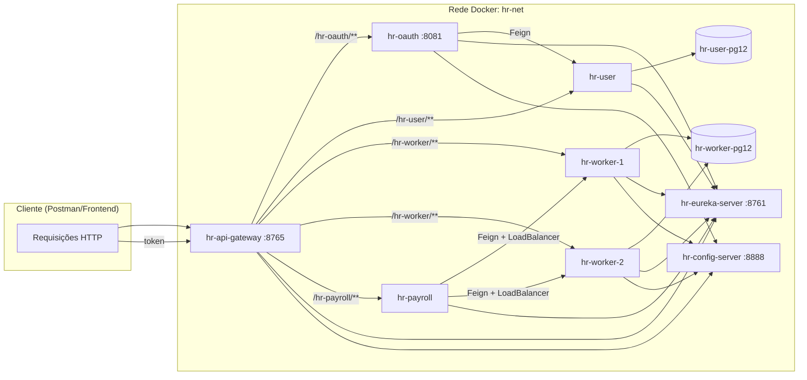

# Curso Microsserviços Java com Spring Boot e Spring Cloud
## Atenção: curso específico para versões Java 17 e Spring Boot 3.3.5
#### Nelio Alves 
- https://www.udemy.com/user/nelio-alves
- https://youtube.com/devsuperior
- https://instagram.com/devsuperior.ig

# Checklist baixar e executar projeto pronto

- JDK 17, variáveis PATH e JAVA_HOME
- Configurar IDE para pegar Java 17
- Importar projetos na IDE
- Configurar credenciais do config server
  - Modelo do curso: https://github.com/acenelio/ms-course-configs
- Preparar Postman (collection e environment)
- Subir projetos em ordem:
  - Config server
  - Eureka server
  - Outros

# Fluxo atual (Docker + OAuth2)

## Subida recomendada

Com os `Dockerfile` e `docker-compose.yml` deste repositório:

```bash
docker compose up --build
```

Serviços publicados no host:
- Gateway: `http://localhost:8765`
- Config Server: `http://localhost:8888`
- Eureka: `http://localhost:8761`
- Postgres hr-user: `localhost:5433`
- Postgres hr-worker: `localhost:5432`

## Fluxo de autenticação atual

Este projeto está no modelo novo com **Spring Authorization Server**:
- endpoint de token: `POST /oauth2/token`
- grant type: `client_credentials`
- autenticação do client via Basic Auth (`client-name` e `client-secret`)

No `docker-compose.yml`, o `hr-oauth` sobe com os defaults:
- `OAUTH_CLIENT_NAME=hr-client`
- `OAUTH_CLIENT_SECRET=hr-secret`

## Diagrama de interação entre microsserviços



# Fase 1: Comunicação simples, Feign, Ribbon

### 1.1 Criar projeto hr-worker

### 1.2 Implementar projeto hr-worker

Script SQL
```sql
INSERT INTO tb_worker (name, daily_Income) VALUES ('Bob', 200.0);
INSERT INTO tb_worker (name, daily_Income) VALUES ('Maria', 300.0);
INSERT INTO tb_worker (name, daily_Income) VALUES ('Alex', 250.0);
```

application.properties
```
spring.application.name=hr-worker
server.port=8001

# Database configuration
spring.datasource.url=jdbc:h2:mem:testdb
spring.datasource.username=sa
spring.datasource.password=

spring.h2.console.enabled=true
spring.h2.console.path=/h2-console
```

### 1.3 Criar projeto hr-payroll

application.properties
```
spring.application.name=hr-payroll
server.port=8101
```

### 1.4 Implementar projeto hr-payroll (mock)

### 1.5 RestTemplate

### 1.6 Feign

### 1.7 Ribbon load balancing

Run configuration
```
-Dserver.port=8002
```
# Fase 2: Eureka, Resilience4j, Spring Cloud Gateway

### 2.1 Criar projeto hr-eureka-server

### 2.2 Configurar hr-eureka-server

Porta padrão: 8761

Acessar o dashboard no navegador: http://localhost:8761

### 2.3 Configurar clientes Eureka

Eliminar o Ribbon de hr-payroll:
- Dependência Maven
- Annotation no programa principal
- Configuração em application.properties

Atenção: aguardar um pouco depois de subir os microsserviços

### 2.4 Random port para hr-worker

```
server.port=${PORT:0}

eureka.instance.instance-id=${spring.application.name}:${spring.application.instance_id:${random.value}}
```

Atenção: deletar as configurações múltiplas de execução de hr-worker

### 2.5 Tolerância a falhas com Resilience4j

### 2.6 Timeout de Hystrix e Ribbon

Atenção: testar antes sem a annotation do Hystrix

```
hystrix.command.default.execution.isolation.thread.timeoutInMilliseconds=60000
ribbon.ConnectTimeout=10000
ribbon.ReadTimeout=20000
```

### 2.7 Criar projeto hr-api-gateway (Spring Cloud Gateway)

### 2.8 Configurar hr-api-gateway

Porta padrão: 8765

### 2.9 Random port para hr-payroll


### 2.10 Gateway timeout

Mesmo o timeout de Hystrix e Ribbon configurado em um microsserviço, se o Zuul não tiver seu timeout configurado, para ele será um problema de timeout. Então precisamos configurar o timeout no Zuul.

Se o timeout estiver configurado somente em Zuul, o Hystrix vai chamar o método alternativo no microsserviço específico.

# Fase 3: Configuração centralizada

### 3.1 Criar projeto hr-config-server

### 3.2 Configurar projeto hr-config-server

Quando um microsserviço é levantado, antes de se registrar no Eureka, ele busca as configurações no repositório central de configurações.

hr-worker.properties
```
test.config=My config value default profile
```
hr-worker-test.properties
```
test.config=My config value test profile
```
Teste:
```
http://localhost:8888/hr-worker/default
http://localhost:8888/hr-worker/test
```

### 3.3 hr-worker como cliente do servidor de configuração, profiles ativos

No arquivo bootstrap.properties configuramos somente o que for relacionado com o servidor de configuração, e também o profile do projeto.

Atenção: as configurações do bootstrap.properties tem prioridade sobre as do application.properties

### 3.4 Actuator para atualizar configurações em runtime

Atenção: colocar @RefreshScope em toda classe que possua algum acesso às configurações

### 3.5 Repositório Git privativo

Atenção: reinicie a IDE depois de adicionar as variáveis de ambiente

# Fase 4: autenticação e autorização

### 4.1 Criar projeto hr-user

### 4.2 Configurar projeto hr-user

### 4.3 Entidades User, Role e associação N-N

### 4.4 Carga inicial do banco de dados

No fluxo atual com Docker + PostgreSQL, os dados são carregados automaticamente via:
- `hr-user/src/main/resources/data.sql`
- `hr-worker/src/main/resources/data.sql`

```sql
INSERT INTO tb_user (name, email, password) VALUES ('Nina Brown', 'nina@gmail.com', '$2a$10$NYFZ/8WaQ3Qb6FCs.00jce4nxX9w7AkgWVsQCG6oUwTAcZqP9Flqu');
INSERT INTO tb_user (name, email, password) VALUES ('Leia Red', 'leia@gmail.com', '$2a$10$NYFZ/8WaQ3Qb6FCs.00jce4nxX9w7AkgWVsQCG6oUwTAcZqP9Flqu');

INSERT INTO tb_role (role_name) VALUES ('ROLE_OPERATOR');
INSERT INTO tb_role (role_name) VALUES ('ROLE_ADMIN');

INSERT INTO tb_user_role (user_id, role_id) VALUES (1, 1);
INSERT INTO tb_user_role (user_id, role_id) VALUES (2, 1);
INSERT INTO tb_user_role (user_id, role_id) VALUES (2, 2);
```

### 4.5 UserRepository, UserResource, Gateway config

### 4.6 Criar projeto hr-oauth

### 4.7 Configurar projeto hr-oauth

### 4.8 UserFeignClient

### 4.9 Geração do Token JWT (fluxo atual)

Token endpoint:
`POST {{api-gateway}}/hr-oauth/oauth2/token`

Headers:
- `Authorization: Basic Base64(client-name:client-secret)`
- `Content-Type: application/x-www-form-urlencoded`

Body (`x-www-form-urlencoded`):
- `grant_type=client_credentials`
- `scope=admin` (ou `operator`)

### 4.10 Autorização de recursos pelo gateway

### 4.11 Deixando o Postman top

Variáveis:
- api-gateway: http://localhost:8765
- config-host: http://localhost:8888
- client-name: hr-client
- client-secret: hr-secret
- token-scope: admin
- token: 

Script para atribuir token à variável de ambiente do Postman:
```js
if (responseCode.code >= 200 && responseCode.code < 300) {
    var json = JSON.parse(responseBody);
    postman.setEnvironmentVariable('token', json.access_token);
}
```
### 4.12 Configuração de segurança para o servidor de configuração

### 4.13 Configurando CORS

Teste no navegador:
```js
fetch("http://localhost:8765/hr-worker/workers", {
  "headers": {
    "accept": "*/*",
    "accept-language": "en-US,en;q=0.9,pt-BR;q=0.8,pt;q=0.7",
    "sec-fetch-dest": "empty",
    "sec-fetch-mode": "cors",
    "sec-fetch-site": "cross-site"
  },
  "referrer": "http://localhost:3000",
  "referrerPolicy": "no-referrer-when-downgrade",
  "body": null,
  "method": "GET",
  "mode": "cors",
  "credentials": "omit"
});
```
